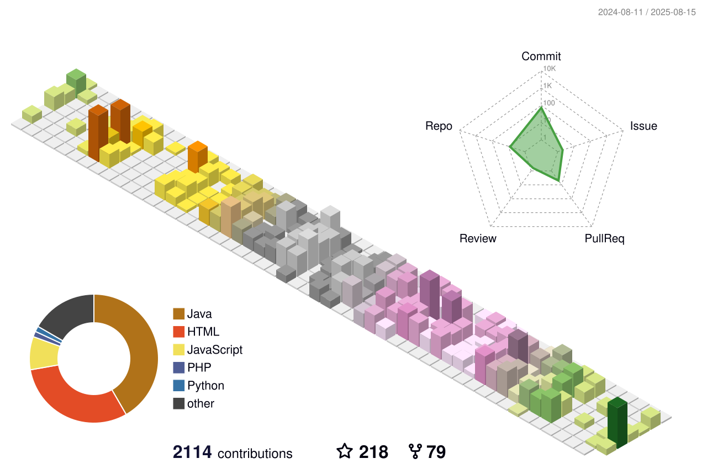

<!-- Sanajit-Jana/sanajitjana's GitHub Profile -->

# Hi, I'm <a href="https://sanajitjana.github.io" target="_blank">Juan Dela Cruz</a>! 

## 🚀 Full-Stack Developer Web & Blockchain Developer

### 📬 Connect with Me:

---

### 🎯 What I'm Working On:
- 🌱 Deepening my expertise in **Spring Boot, AWS, PostgreSQL, Docker, and Microservices**
- 🛠️ Building **scalable microservice-based backend solutions**
- 👥 Open to collaborating with other developers and contributing to **Open Source**
- 🎯 Goals: Deliver high-performance projects & enhance system architecture skills
- 📢 Check out my portfolio: **[portfolio](https://portfolio-chi-six-64.vercel.app)**
- 📝 View my **[Resume](https://github.com/GreenCode668/GreenCode668/blob/main/JuanDelaCruzResume.pdf)**

---

<h3 align="left">Languages and Tools:</h3>

                            

---

### ⚡ Interests & Hobbies:
- 💻 Exploring new technologies & scalable architectures
- 🏍️ Riding & traveling
- 🎯 Competitive coding & problem-solving

---

### 📊 GitHub Stats:

    
  

---

### 📢 Let's Build Something Amazing Together!
💡 Have an exciting project idea? Let's discuss! Feel free to **connect** 🚀
